<h2 align="center">Olá 👋! Sou a Adowalma, amante de tecnologia, arte e educação.</h2>

###

 

 

 

###

<h3 align="center">Tecnologias Mais Usadas:</h3>

###

  
  
  
  
  
  
  
  
  
  
  
  
  
  
  
  
  

###

<h3 align="center">Conecte-se à mim:</h3>

###

  
  

###
